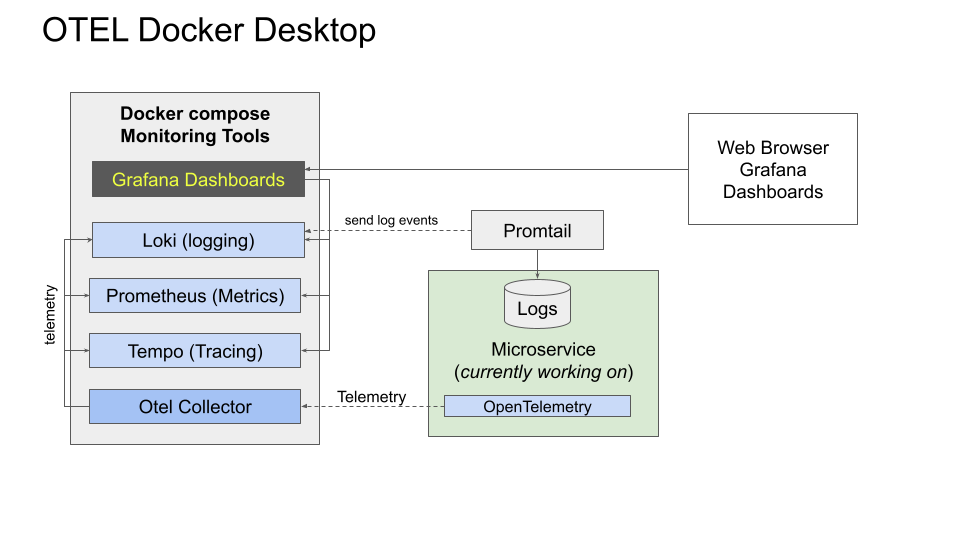

# OTEL Desktop

The OTEL Desktop aims to make it easy for a developer to 
run and view telemetry from their desktop. The monitoring tools
are started locally on the desktop, making it easy to experiment
and verify telemetry. We chose to run everything locally to make it as easy as possible for developers to be productive with. 

The project  includes serveral services as examples
to try out OTEL Desktop with as well as provide examples
of OTEL manual instrumentation. 

This also includes instructions and configuration to setup 
using docker-compose or k8/Istio. Most developers will want to use
docker-compose because it's much easier to operate. 

## Example microservices 

This example services are very simple. All are in the /services folder in this project.

* cart-svc - a service that represents a shopping cart interface for a web or mobile app.

* inventory-svc - a service used by cart-svc for inventory used by the cart. cart-svc makes calls to inventory-svc. 

* tutorial-svc - a standalone service that stores tutorials in a 
local HSQL database. 

For small, single request traffic Insomnia or Postman is recommended. For many tests and experiments, K6 is preferred so you can generate enough traffic/data to kickstart the monitoring tools.

Note that the "run-microservices.sh" script in each example service contains environment variable
settings used by opentelemetry's auto-instrumentation that can be used if you run services stand-alone, outside of a docker container or kubernetes.

## Docker Desktop Topology

Below is a diagram of what OTEL docker desktop includes:

### Setup and run Docker Desktop Demo
Read the instructions below for setting up a docker desktop mode
demo on your machine: 
[Setup Docker Desktop Mode](./docker-composed/README.md)

## K8/Istio desktop mode

This mode requires installing kubernetes/istio on your desktop.
The monitoring tool backend is deployed to kubernetes. 
Your services are deployed into kubernetes. 
This is more complicated to use that the docker desktop mode, but
it more accurately mirrors what you'd find in a deployment environment.

This mode is required to see any of the Istio-generated telemetry. 

### Setup and run K8/Istio Desktop Mode

Read the instructions in this readme file:
[Run microservices in K8/Istio desktop mode](./k8-istio/README.md)

-eod