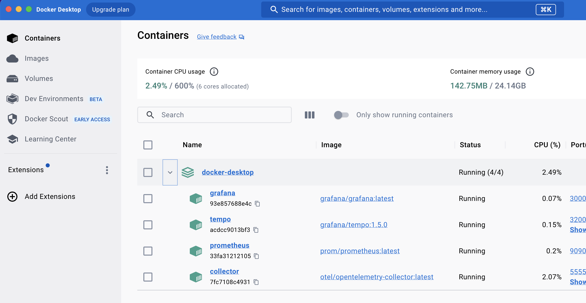
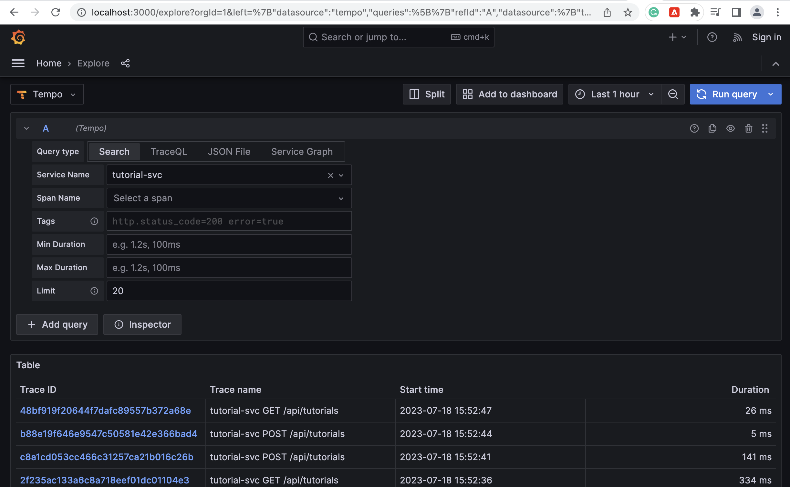
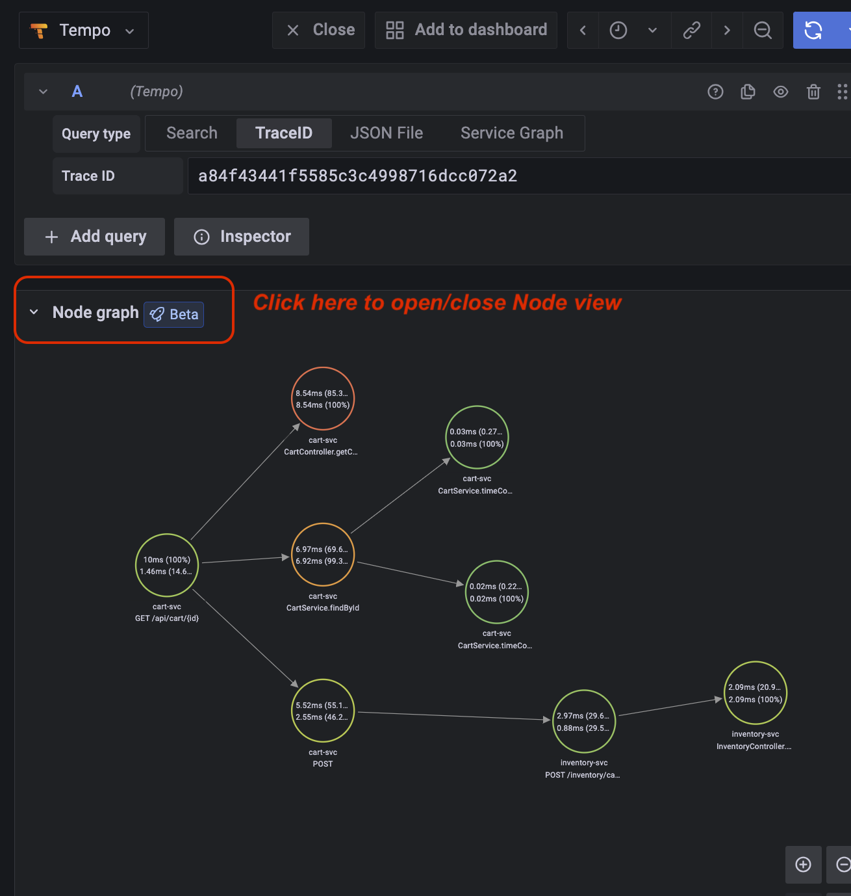
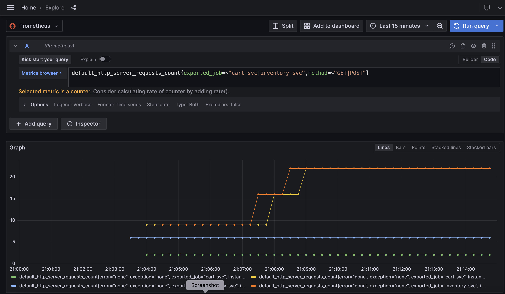
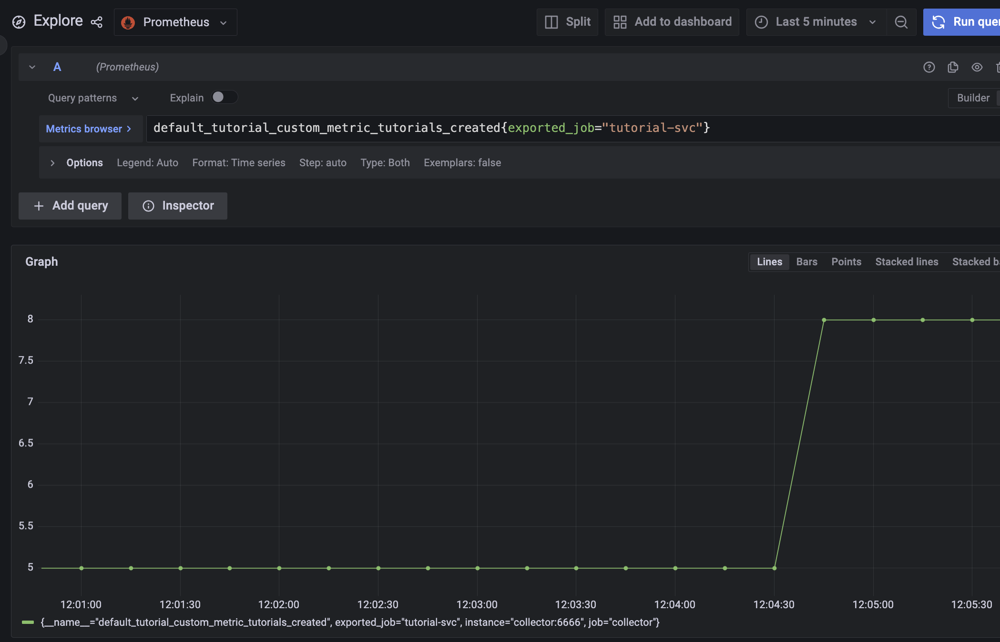
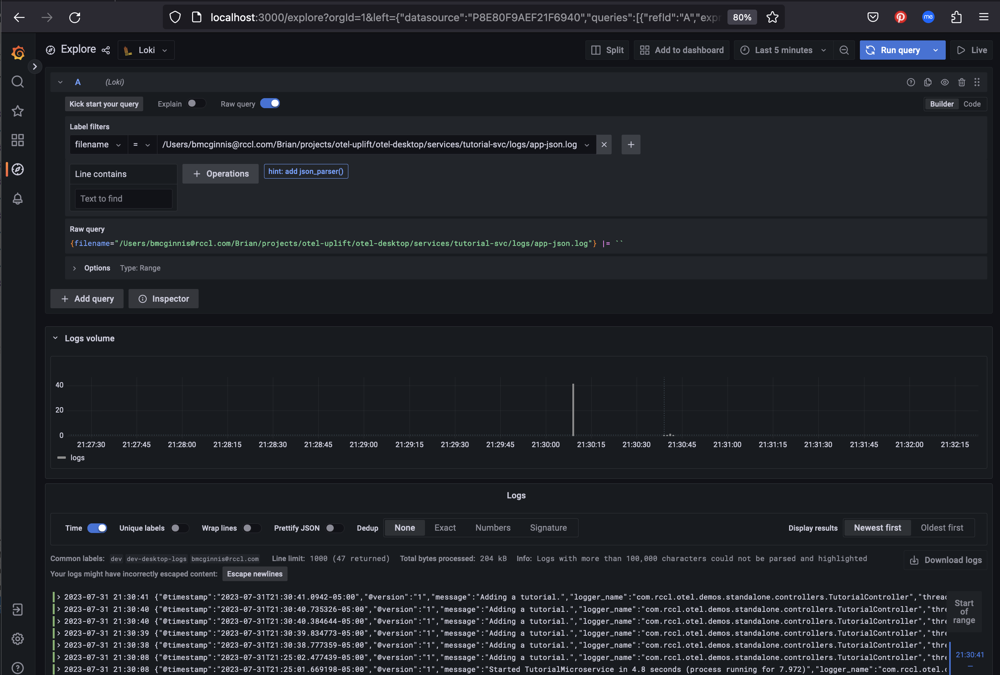

# Docker Desktop Environment
This desktop uses docker compose and runs as shown in the diagram below:


The instructions below presume you have docker desktop installed.
(If you are running a local kubernetes cluster on your desktop,
you should shut it down before starting this demo setup).

It is important to note the monitoring tool backend all runs in
docker containers as described above (not kubernetes).


## Running the example microservices

First step: open 3 terminals to start the services and cd to this project's base directory. 

You will need the starting script "run-microservice.sh" to set the
environment variables fwith OpenTelemetry javaagent for
the automatic open telemetry instrumentation to take effect.

```
// terminal #1
// builds inventory service and runs on port 8081
$ cd ./services/inventory-svc 
$ ./run-microservice.sh


// terminal #2
// starts cart service on port 8080
$ ./services/cart-svc
$ ./run-microservice.sh


// terminal #3
// starts tutorial service on port 8082
$ ./services/tutorial-svc
$ ./run-microservice.sh

```
## Running Monitoring tools

This demo uses prometheus (for metrics), loki (for traces) and grafana (dasboards).

### Setting required environment variables

For running Grafana and promtail (for logging), you will need
to set these environment variables before starting those up. 

* **IP_ADDRESS** - set this to your machine's IP addresss
* **APP_LOG_DIR** - set this to the log files you want to import to Loki. 

If you are doing a demo, use the tutorial-svc as the location
to pick logs from. 

```
# Used by Grafana only
$ export IP_ADDRESS=192.168.0.7

# Used by promtail. Don't forget the *.log suffix.
$ export APP_LOG_DIR=../services/tutorial-svc/logs/*.log
```
For background information on why promtail is used and Grafana
IP adderess was needed, see the appendix. 

### Starting monitoring tools via docker compose.
After setting your environment variables, you can start and end your monitoring tool backend using 'docker compose up' from this project's root
direactory and tear the
containers down using 'docker compose end' when complete.

Open up a 4th terminal for this part. 
Start the monitoring tools and verify they run.

```
$ cd ... to Home of docker-compose.yaml file.
$ docker compose up
```
The easiest way to see if things are working is to use Docker Desktop dashboard and loot at the
"containers" view.

On Grafana, goto menu "Explore". The data sources selector
is at the upper left corner. Verify the Tempo, Loki and Prometheus
data sources are configured for you.

If everything works you should see all the tools running like this (using docker desktop
to view containers):


You can shut the tools down by:
``` 
// Kill the docker compose process.
type ctrl-C in the terminal where docker compose started. 

// Cleanup by removing the docker artifacts
$ docker compose down
``` 

### Installing promtail

You need only install the promtail tool once on your maching and it gets reused for all your projects. 

These are instructions for install a local promtail app
on your desktop. You will only need to do this once, not 
for every app. 

Follow grafana instructions to install locally, run outside of docker so the log file changes get propagated immediately. 

https://grafana.com/docs/loki/latest/installation/local/

Current version at time of this writing is loki and promtail is version v2.8.0

Download the "binary" version (not the docker version) so we can run it as a stand-alone app outside of docker. 

Download promtail binary. 
```
$ cd to a central place you install your dev tools/apps

// create a promtail directory for artifacts
$ mkdir promtail-dist
$ cd promtail-dist

//
// Depending on your machine, download the 
// appropriate promtail binary. 
//

// Download promtail binary if mac M1 chip
$ curl -O -L "https://github.com/grafana/loki/releases/download/v2.8.0/promtail-darwin-arm64.zip"

// Download promtail binary if mac Intel chip
$ curl -O -L "https://github.com/grafana/loki/releases/download/v2.8.0/promtail-darwin-amd64.zip"

// Download promtail binary if Linux
$ curl -O -L "https://github.com/grafana/loki/releases/download/v2.8.0/loki-linux-amd64.zip" 
```

Next, unzip the binary and put it in your
central app tools directory so you can use it
anytime you need. 

```
// Unzip it
$ unzip ./promtail-darwin-arm64.zip 

// rename it with a ln command
$ cd ..
$ ln -s ./promtail-dist/promtail-darwin-amd64 promtail

// verify it runs okay
./promtail -version

// add the promtail binary all to your $PATH
vi ~/.zshenv  (or other for your env vars)

// open a new shell and verify we can see the binary
$ which promtail
```

### Starting promtail
After setting your environment variables, open a 5th terminal 
to run promtail to read your local log files into Loki. 

If you haven't run promtail yet, it is recommended to first run
in "dry run" mode to make sure it's fetching log files as expected, then run in normal mode. 

You should see output free of errors and that it found your log files and worked on them. You should see some log output dumped to the console with 
your logfile entries. 

#### Verify promtail picks up your microservice's logs

Verify your config file for promtail is free
of issues. Use the "dry-run" mode of promtail and check the output from it for any errors. 

**IMPORTANT:** Make sure your $APP_LOG_DIR env variable is set per previous step in the terminal you use to start promtail, or promtail will not see your log files. 

```
// Run promtail in dry-run mode. 
$ promtail -dry-run -print-config-stderr -config.file ./otel-config/promtail-config.yaml -config.expand-env
``````

You should see output free of errors and that it found your log files and worked on them. You should see some microservice log output dumped to the console with 
your logfile entries. 


Sample promtail dry-run output:
```
$ cd to base directory where docker-compose.yaml file resides.

$ promtail -dry-run -print-config-stderr -config.file ./otel-config/promtail-config.yaml -config.expand-env

Clients configured:
----------------------
url: http://172.16.224.131:3100/loki/api/v1/push
batchwait: 1s
batchsize: 1048576
... snip to show output of log file data...
2023-07-27T18:39:40.56636-0500	{env="dev", filename="/Users/bmcginnis@rccl.com/Brian/projects/otel-uplift/desktop-demos/services/tutorial-svc/logs/app-json.log", job="dev-desktop-logs"}	{"@timestamp":"2023-07-27T18:35:41.437363-05:00","@version":"1","message":"No active profile set, falling back to 1 default profile: \"default\"","logger_name":"com.rccl.otel.demos.standalone.TutorialMicroservice","thread_name":"main","level":"INFO","level_value":20000}

... snip ...
```

#### Start the promtail app

Open a terminal and run promtail:

```
$ cd to base directory where docker-compose.yaml file resides.

$ promtail -print-config-stderr -config.file ./otel-config/promtail-config.yaml -config.expand-env
```


# View telemetry from microservices

## Generating some request traffic

Below are some curl commands you can use to send
cart and inventory service some traffic that we
can then view metrics and traces for.

### Inventory Service CURL requests

```
curl http://localhost:8081/inventory/cookie

curl http://localhost:8081/inventory/oatmeal

curl http://localhost:8081/inventory/coffee_beans
```

### Cart service Curl requests

```
curl http://localhost:8080/api/cart/1

curl http://localhost:8080/api/cart/2

curl http://localhost:8080/api/cart/3

curl http://localhost:8080/api/cart

```

### Tutorial service requests

```
// Create tutorial
curl 'http://localhost:8082/api/tutorials' \
--header 'Content-Type: application/json' \
--data '{
    "title": "To write a great American novel.",
    "description": "An American classic book."
}'

// Find the tutorial
curl --location http://localhost:8082/api/tutorials/1

// Find all tutorials
curl --location http://localhost:8082/api/tutorials
```

## View Traces from Tempo

Open Grafana with http://localhost:3000. Then click on the "Explore" menu option.
Select "Tempo" as your datasource, then click on the "Search" tab. Select "tutorial-svc"
from the drop-down menu. Then click on search. It should look something like the following:



Make sure the time selector in the upper right nav area is set to a time range close to when you
generated the traffic or you won't see any results!

Now you can click on spans tempo collected for you
to drill down into them.

You can view traces in "Node view" with using latest Grafana features as shown below:




## View metrics from Prometheus

#### Prometheus Metric Renaming
Metric renaming by Prometheus causes a lot of confusion for those
unfamiliar with this side-effect behavior. 
Prometheus converts characters it doesn't like into underscores automatically. A name like "mynamespace.custom.cool" becomes "mynamespace_custom_cool" for example. 

The otel metric names in our setup all start with the prefix "default_". For example, "default_http_server_requests_count".

### Viewing otel auto-instrumented metrics

Navigate to the Grafana Explore feature. Select "Prometheus" as the data source.
In the "metrics browser" area enter a metric query such as:

```default_http_server_requests_count{exported_job=~"cart-svc|inventory-svc",method=~"GET|POST"}```


Set the time range to say "Last 15 minutes" to see data in more detail, then
hit the "Run Query" button in the upper left corner of the panel. You should see a chart
like the one shown below:



### OTEL Auto-Instrumented metrics

The metrics generated are subject to change per the Java auto
instrumentation library. In this case, we are mostly interested in the webflux library instrumentation. The information here may change without notice. 


Here is an example where you see how they created instrumentation and note the hard-coded metric naming such as ""http.server.request.size": https://github.com/open-telemetry/opentelemetry-java-instrumentation/blob/main/instrumentation-api-semconv/src/main/java/io/opentelemetry/instrumentation/api/instrumenter/http/HttpServerMetrics.java

Their metric generated "http.server.request.size" as gets translated by prometheus into three metrics  we see available to our Grafana as "default_http_server_request_size_count" and "default_http_server_request_size_sum" and "default_http_server_request_size_bucket". Because it is a historgram type of metric, prometheus generates the "_sum", "_count" and _"bucket" metrics for a historgram metric named "http.server.request.size". 

You can read about different prometheus metrics types here: https://prometheus.io/docs/concepts/metric_types to understand what the suffixs for a metric are (_bucket).

OTEL has defined it's own types of metrics, similar in name to Prometheus's metrics types but a little different, which at the end of the day have to be transformed into metrics Prometheus undersands because Prometheus has to process them. When we look in Grafana for metrics, we see the Prometheus translation of them. 


#### Interpreting prometheus metric names to OTEL Documentation.
As stated earlier prometheus renaming makes it confusint to figure
out what the auto-instrumented metrcs are in order to understand them. 

For example this metric: **default_http_server_requests_count**

is actually constructed as 
- "default_" - An obligatory prefix generated by otel
- "http_server" - translates to OTEL http.server 
- "request_count" - 


### Viewing a custom metric

The tutorial-svc contains a custom metric we put in it's Controller. A custom counter is incremented every time you create a new tutorial so we can make a business metric on how many tutorials our staff is creating for our tutorial users. You can increment this counter manually using:
```
// Create a tutorial
curl 'http://localhost:8082/api/tutorials' \
--header 'Content-Type: application/json' \
--data '{
    "title": "Testing add of new tutorial.",
    "description": "Trying out my custom counter metric."
}'
```

Just for reference, the code snippets for creating the custom metric is:
```
public class TutorialController {
  ...snip...
  private LongCounter tutorialsCreated;

  public static final String METRIC_PREFIX = "tutorial.custom.metric.";

  public static final String NUMBER_OF_TUTORIALS_CREATED = METRIC_PREFIX + "tutorials.created";

  public static final String NUMBER_OF_TUTORIALS_CREATED_DESCRIPTION = "Counts the number of tutorials created.";

  @PostConstruct
  public void createMetrics() {

    tutorialsCreated =
        meter
            .counterBuilder(TelemetryConsts.NUMBER_OF_TUTORIALS_CREATED)
            .setDescription(TelemetryConsts.NUMBER_OF_TUTORIALS_CREATED_DESCRIPTION)
            .setUnit("int")
            .build();
  }

```
Notice how the metric code named our custom metric as "tutorial.custom.metric.tutorials.created" and it was transformed by Prometheus into *default_tutorial_custom metric_tutorials_created*.


Run some tutorial create requests, then
open prometheus in explore mode. Enter the search criteria as shown in the screenshow below to view our custom metric.



## View Logs from Loki

While in Grafana, select "Loki" as the data source. Then select a label filter and value of interest from the drop-down choices in the loki query panel. Set the time range selector to the last 15 minutes (assuming you are currently running the microservice). Hit the green query button. 

You should see some log events show up in the bottom panel of the dashboard.




---
# APPENDIX
---

## GOTCHA's The issues and work-arounds

### Docker mount not refreshing with recent log file updates

There seems to be an issue with Docker Desktop and mounted directories. If you run Loki in a docker container or docker-compose, it will load the log files the first time, then it will fail to load any new log entries from your file afterwards. I verified this issue by looking at a docker-hosted promtail and loki services, promtail's mounted directory for logs could see the log file contens (from docker's shell) but it could not see any recent additions to the log file after the log directory was mounted. The side-effect is promtail would read new log events only when it was restarted, then no new log events afterwards. 

As a work-around for this environment, we run "promtail" as a local app. Promtail is the service that reads your log files and ships them to Loki. This is a HASSLE to be sure, but it does refresh Loki with your new log file events.

We use grafana's promtail for uploading app logs into Loki.


# Run docker-compose to start Loki and Grafana

Now, run docker-compose to start up Loki 
and Grafana. 

## Browse logs in grafana

After promtail is started and docker-compose starts the services, do the following:

1. Generate some traffic upon your microservice to generate log events. (You should do this before looking at dashboards because Grafana thinks your Loki/Promtail link is broken until there is new log data available in Loki).

2. Verify your datasource is working. Use the 'Connections' option in the hamburger menu. 
Select 'Data Sources', then select 'Loki'. Click on the "Save and Test" button to verify it works.

3. Use the Explore option to navigate to use Loki in a dashboard. 

**IMPORTANT**
Make sure you set Loki's data source url 
is set to: http://loki:3100
 (not localhost like 
grafana's default http://localhost:3100)
or grafana will fail to load Loki data source with the error 
```Unable to connect with Loki (Failed to call resource). Please check the server logs for more details.```


---
# Troubleshooting
---


### General Issues

Sometimes Grafana stores information in the docker image and doesn't
let go of it. You can restart grafana from docker over and over and it
still fails. If you have tried everything else, stop grafana and delete your docker container and any docker volumes with "grafana" name for them you created for it. Sometimes docker holds on to old data source definitons and old IP's for some reason. 

Then go into your docker images and remove any grafana images there too. Restart grafana with a clean slate. 

### Error - Data source connected, but no labels received  

You will see this when trying to add Loki as a data source in grafana. 

Verify that Loki and Promtail is configured properly.” This error can appear in Grafana when Loki is added as a datasource, indicating that although Grafana has connected to Loki, Loki hasn't received any logs from Promtail yet.

First, try to generate some log events in your app for promtail to read. You will see this message if promtail started up and you have NOT SENT ANY TRAFFIC for it to send to loki! Grafana assumes if Loki hasn't got any data since it started, that it isn't fit for creating dashboards for. Bad grafana!

Second, This can happen if your promtail-config.yaml is setup wrong and the log files are not being
found by promtail. 

IMPORTANT: promtail won't work with relative directories from where you start app from, use an absolute path to your log directory to be sure
it's looking in the same directory for logs you expect. 

Another way you can tell your config is wrong is when you run promtail with the -dry-run option and you don't see it loading any of your log file entries as it runs. 

Example promtail-config.yaml scraping configuration:
```
// This scrape config works properly....
scrape_configs:
- job_name: system
  static_configs:
  - targets:
      - localhost
    labels:
      job: localhost-logs
      env: dev
      __path__: /Users/bmcginnis@rccl.com/Brian/projects/otel-uplift/desktop-demos/services/tutorial-svc/logs/*.log

// This scrape config does not work!
scrape_configs:
- job_name: system
  static_configs:
  - targets:
      - localhost
    labels:
      job: localhost-logs
      env: dev
      __path__: ../services/tutorial-svc/logs/*.log
```


### Error - Unable to connect with Loki (Failed to call resource). Please check the server logs for more details

This means grafana can't see the loki server. By checking logs, the logs to check are grafana server first. 

Here is an example issue from grafana log: 
```
023-07-27 14:17:55 logger=context userId=1 orgId=1 uname=admin t=2023-07-27T19:17:55.410852107Z level=error msg="Request Completed" method=GET path=/api/datasources/uid/d794eba3-bf8a-46c8-816c-789a1d374ab4/resources/labels status=500 remote_addr=172.17.0.1 time_ms=4006 duration=4.006774549s size=51 referer=http://localhost:3000/connections/datasources/edit/d794eba3-bf8a-46c8-816c-789a1d374ab4 handler=/api/datasources/uid/:uid/resources/*
```

### Error - promtail not connecting to loki

If promtail can not send data to Loki, you will see log events from promtail similar to that shown below. In this case, the reason is the promtail-config.yaml file contained the wrong machine IP address and promtail could not connect to Loki to send the log events to it. 

```
level=info ts=2023-07-27T23:50:50.537986Z caller=tailer.go:152 component=tailer msg="tail routine: exited" path=/Users/bmcginnis@rccl.com/Brian/projects/otel-uplift/desktop-demos/services/tutorial-svc/logs/app-json.log
level=info ts=2023-07-27T23:50:50.537995Z caller=tailer.go:240 component=tailer msg="stopped tailing file" path=/Users/bmcginnis@rccl.com/Brian/projects/otel-uplift/desktop-demos/services/tutorial-svc/logs/app-json.log
level=info ts=2023-07-27T23:50:50.538032Z caller=tailer.go:116 component=tailer msg="position timer: exited" path=/Users/bmcginnis@rccl.com/Brian/projects/otel-uplift/desktop-demos/services/tutorial-svc/logs/app-text.log
level=info ts=2023-07-27T23:50:50.538072Z caller=tailer.go:159 component=tailer msg="tail routine: tail channel closed, stopping tailer" path=/Users/bmcginnis@rccl.com/Brian/projects/otel-uplift/desktop-demos/services/tutorial-svc/logs/app-text.log reason=null
level=info ts=2023-07-27T23:50:50.538092Z caller=tailer.go:152 component=tailer msg="tail routine: exited" path=/Users/bmcginnis@rccl.com/Brian/projects/otel-uplift/desktop-demos/services/tutorial-svc/logs/app-text.log
```

## EXTRA - TROUBLESHOOTING: Running with the debug collector
If telemetry connections get squirrely, use the debug collector
configuration to send all telemetry to be logged to the collector's output
so you can read it.

Make sure your expporters are exporting to otlp
and restart your sevice with the following env vars set.
```
export OTEL_TRACES_EXPORTER=otlp
export OTEL_METRICS_EXPORTER=otlp
export OTEL_EXPORTER_OTLP_ENDPOINT=http://localhost:5555
export OTEL_RESOURCE_ATTRIBUTES=service.name=tutorial-svc,service.version=0.0.1-SNAPSHOT
```

Run the collector in a new separate terminal, so you can read the output from it.
```
$ docker run -v ./tool-config/collector-debug.yaml:/etc/otelcol/config.yaml -p 5555:5555 otel/opentelemetry-collector:latest
```
If the container started right, you should see a message
at the bottom like: "Everything is ready. Begin running and processing data."

You won't see logging output from your service in the terminal anymore. BUT, you
will see log output in the terminal where you are running the debug collector
you started above.


-eod