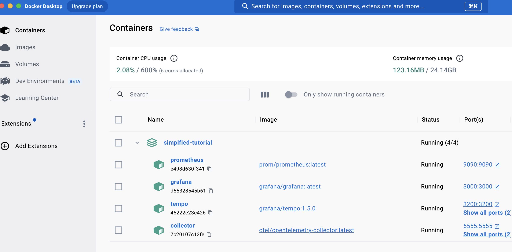
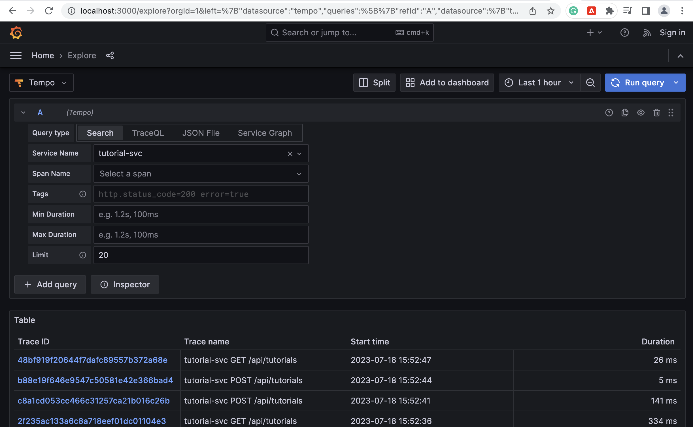
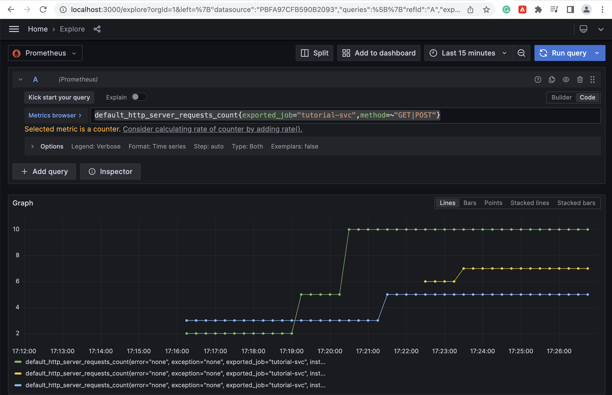
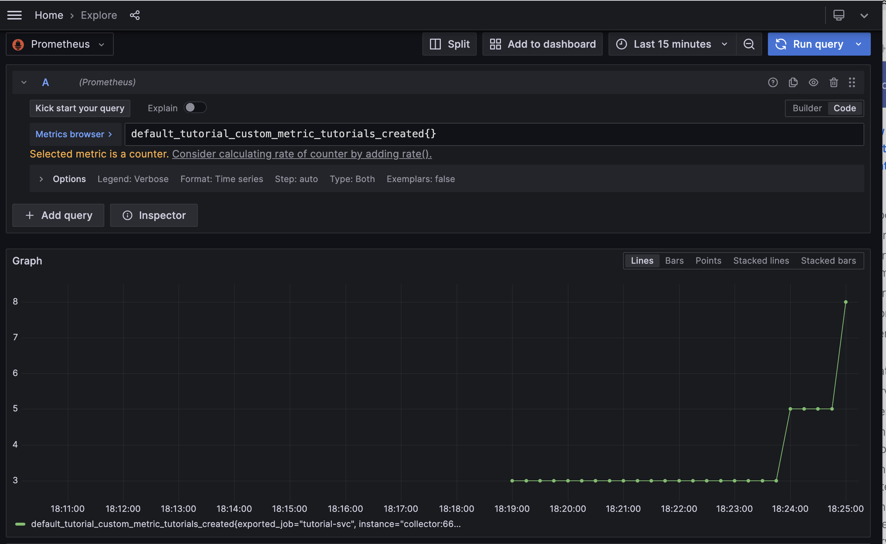

# OTEL simple tutorial

This is a simple project to demonstrate use of open telemetry
without kubernetes/istio. This is the easiest way to learn
and experiment with open telemetry to see how it works, by
itself.


We will run the monitoring tools using Docker Compose, making
it easier to configure them as you like.

To keep it as simple as possible, we will use a single code base to implement a microservice
that runs within docker separately called "tutorial-svc".

We will run this using two terminals:
1. Terminal 1 - run your microservice from the command line with script: "./run-microservice.sh"
2. Terminal 2 - run your telemetry monitoring backend with docker compose.

Note that the "run-microservices.sh" contains environment variable
settings used by opentelemetry's auto-instrumentation. You will need
to provide values for these or the telemetry won't work. 

## Logging

This demo uses Loki as a log aggregation tool. The log output is processed
with Logback as a simple way to separate out applicat log events (in json)
from the noisy crap that Spring emits to console that we don't want. 

The log files are:
* app-json.log - JSON formatted application log data that was written to a file. 
* app-text.log - Text unformatted console output that gets emitted from spring. 

The log output ultimately is routed to Loki via grafana promtail. Promtail
reads the microservices log files from a directory and routes them to Loki. 

## Run monitoring tools via docker compose.
You can start and end your monitoring tool backend using 'docker compose up' and shut the 
containers down using 'docker compose end' from the project home directory. 

Start dockered monitoring tools and verify they run. 

```
$ docker compose up
```
Hit the UI of monitoring tools to verify they are running okay:
* Grafana: http://localhost:3000
* Prometheus: http://localhost:9090/status
* Tempo: http://localhost:3200/status

On Grafana, goto menu "Explore". The data sources selector
is at the upper left corner. Verify the Tempo and Prometheus
data sources are configured for you. 

If everything works you should see all the tools running like this (using docker desktop
to view containers):



## DEBUG: Running with the debug collector
If telemetry connections get squirrely, use the debug collector
configuration to send all telemetry to be logged to the collector's output
so you can read it. 

Make sure your expporters are exporting to otlp
and restart your sevice with the following env vars set.
```
export OTEL_TRACES_EXPORTER=otlp
export OTEL_METRICS_EXPORTER=otlp
export OTEL_EXPORTER_OTLP_ENDPOINT=http://localhost:5555
export OTEL_RESOURCE_ATTRIBUTES=service.name=tutorial-svc,service.version=0.0.1-SNAPSHOT
```

Run the collector in a new separate terminal, so you can read the output from it. 
```
$ docker run -v ./tool-config/collector-debug.yaml:/etc/otelcol/config.yaml -p 5555:5555 otel/opentelemetry-collector:latest
```
If the container started right, you should see a message
at the bottom like: "Everything is ready. Begin running and processing data."

You won't see logging output from your service in the terminal anymore. BUT, you 
will see log output in the terminal where you are running the debug collector 
you started above. 

# View traces and metrics

Hit the tutorial service with some traffic, then view some traces and metrics from it.

## View Traces from Tempo

Open Grafana with http://localhost:3000. Then click on the "Explore" menu option. 
Select "Tempo" as your datasource, then click on the "Search" tab. Select "tutorial-svc"
from the drop-down menu. Then click on search. It should look something like the following:



Make sure the time selector in the upper right nav area is set to a time range close to when you 
generated the traffic or you won't see any results! 

Now you can click on spans tempo collected for you 
to drill down into them. 

## View metrics from Prometheus

The auto-instrumentation metric names start with the prefix "default_". For example, 
"default_http_server_requests_count". 

Navigate to the Grafana Explore feature. Select "Prometheus" as the data source. 
In the "metrics browser" area enter a metric query such as:

```default_http_server_requests_count{exported_job="tutorial-svc",method=~"GET|POST"}```

Set the time range to say "Last 15 minutes" to see data in more detail, then 
hit the "Run Query" button in the upper left corner of the panel. You should see a chart
like the one shown below:



# Custom Metrics

The demo app is all about Tutorials. As a business, we proably want to know when
tutorials are created to have an idea how much content is being created for use. 
We will create a simple counter custom metric that increments each time a tutorial
gets created by the app. 

The metrics code is in the file: TutorialController.java

If you create some tutorials, then use grafana, you can view the metric as shown
in the screenshot below:




# Custom Tracing

---
# OLD
Compile and deploy serivces:
```
// In shell you run commands in (in otel-agent/script):
export JAVA_TOOL_OPTIONS="-javaagent:../otel-agent/opentelemetry-javaagent.jar" \
  OTEL_TRACES_EXPORTER=logging \
  OTEL_METRICS_EXPORTER=logging \
  OTEL_LOGS_EXPORTER=logging
  
cd ./service-cart
docker rmi -f simplfied-tutorial-cart-svc 
mvn clean
mvn package 

cd ..


cd ./service-inventory
docker rmi -f simplfied-tutorial-inventory-svc 
mvn clean
mvn package

cd ..

docker compose up
```

Show jaeger UI in browser
```
http://localhost:16686/search
```

Show prometheus UI
```
http://localhost:9090
```
Show grafana UI
```
http://localhost:3000
```
#

This is a simple project to demonstrate use of open telemetry
without kubernetes/istio. This is the easiest way to learn
and experiment with open telemetry to see how it works, by
itself. 


We will run the monitoring tools using Docker Compose, making
it easier to configure them as you like. 

To keep it as simple as possible, we will use a single code base to implement 2 microservices
that run within docker separately: a Cart service and an Inventory service. 
Cart calls Inventory service in our example use cases.
We will use tracing to observe traffic between them. 


# System startup

## Start Jaeger in local docker

You might wonder why jaeger does not run in the
Docker Compose below. There is an issue getting it running
that way, which is why it is started separately.

This instruction taken from Jaeger: https://www.jaegertracing.io/docs/1.40/getting-started/#all-in-one
```
docker run -d --name jaeger \
  -e COLLECTOR_ZIPKIN_HOST_PORT=:9411 \
  -e COLLECTOR_OTLP_ENABLED=true \
  -p 6831:6831/udp \
  -p 6832:6832/udp \
  -p 5778:5778 \
  -p 16686:16686 \
  -p 4317:4317 \
  -p 4318:4318 \
  -p 14250:14250 \
  -p 14268:14268 \
  -p 14269:14269 \
  -p 9411:9411 \
  jaegertracing/all-in-one:1.40

```

Next, open the jaeger UI on http://localhost:16686.

## Start Prometheus and Grafana

```
// Run in terminal foreground
docker compose up

// ...or... Run in terminal background
docker compose up -d
```

To shut down:
```
docker compose down
```

To check if tools are running in docker:
```
docker ps | grep prometheus
docker ps | grep grafana
```
then check prometheus is ready to use:
http://localhost:9090/status

then check grafana ready to use open:
http://localhost:3000/datasources
then click on the 'prometheus' data source in the
web page, scroll to the bottom of page and click the
'Test' button. It should check ok and turn green.

You can use the tools with their web ui:
* Prometheus - http://localhost:9090
* Grafana - http://localhost:3000

## OpenTelemetry Collector
The open telemetry collector uses the config file
in /tool-config/open-telemetry-collector.yaml

It exposes the endpoint 5555 for otel protocol from your app.

To start it:
```
docker run \
 -v $(pwd)/tool-config/open-telemetry-collector.yaml \
 -p 5555:5555 \
 otel/opentelemetry-collector:latest
```
When you see the output contain the phrase
*"Everything is ready. Begin running and processing data."* it's ready to use.

In order to use the otel collector, we have to tell our
service to use our collector as the destination for its traces and metrics.
You'll use a special startup script to run for otel collector:
```
$ run-with-auto-inst-to-otel-collector.sh

// You should see output similar to this...
 .   ____          _            __ _ _
 /\\ / ___'_ __ _ _(_)_ __  __ _ \ \ \ \
( ( )\___ | '_ | '_| | '_ \/ _` | \ \ \ \
 \\/  ___)| |_)| | | | | || (_| |  ) ) ) )
  '  |____| .__|_| |_|_| |_\__, | / / / /
 =========|_|==============|___/=/_/_/_/
 :: Spring Boot ::                (v3.1.1)

2023-07-13 12:20:25.989  INFO [standalone-otel,,] 10211 --- [           main] c.r.o.d.s.StandaloneApplication          : Starting StandaloneApplication v0.0.1-SNAPSHOT using Java 19.0.1 with PID 10211 (/Users/bmcginnis@rccl.com/Brian/projects/otel-uplift/otel-foundation/otel-standalone-tutorial/target/standalone-otel-0.0.1-SNAPSHOT.jar started by bmcginnis@rccl.com in /Users/bmcginnis@rccl.com/Brian/projects/otel-uplift/otel-foundation/otel-standalone-tutorial) 
2023-07-13 12:20:25.993  INFO [standalone-otel,,] 10211 --- [           main] c.r.o.d.s.StandaloneApplication          : No active profile set, falling back to 1 default profile: "default" 
2023-07-13 12:20:27.948  INFO [standalone-otel,,] 10211 --- [           main] c.r.o.d.s.config.EnvironmentConfig       : Otel Resource is: Resource{schemaUrl=null, attributes={service.name="standalone-otel", telemetry.sdk.language="java", telemetry.sdk.name="opentelemetry", telemetry.sdk.version="1.28.0"}} 
2023-07-13 12:20:28.455  INFO [standalone-otel,,] 10211 --- [           main] o.s.b.a.e.web.EndpointLinksResolver      : Exposing 1 endpoint(s) beneath base path '/actuator' 
2023-07-13 12:20:29.138  INFO [standalone-otel,,] 10211 --- [           main] o.s.b.web.embedded.netty.NettyWebServer  : Netty started on port 8080 
2023-07-13 12:20:29.157  INFO [standalone-otel,,] 10211 --- [           main] c.r.o.d.s.StandaloneApplication          : Started StandaloneApplication in 3.719 seconds (process running for 11.902) 

```

## Build target and run on command line

### Downloading otel java agent
If you haven't done so already, download the open
telemetry agent and put it in your system.
Follow instructions from open telemetry:
https://opentelemetry.io/docs/instrumentation/java/automatic/

Copy or link the opentelemetry-javaagent.jar file to
this project's /otel-dist directory.


### Startup Server

Use the following shell script to rebuild and run
the service with auto-instrmented otel tracing, etc.

**IMPORTANT**: You have to rebuild every time because we
use a javaagent that runs with the target built jar file.
Local changes in your IDE won't be picked up by the agent.

It will send tracing to your running localhost Jaeger (see instructions above).

From project home dir:
```
$ ./run-with-auto-instrumentation.sh

```
## Details about running with otel auto-instrumentation

For list of otel env variables and properties for configuring exporters:
See: https://github.com/open-telemetry/opentelemetry-java/blob/main/sdk-extensions/autoconfigure/README.md

```
// First, tell opentelemetry library to dump trace and metrics output to logging (console). 
// Otherwise, you'll get an error it will try to send to servers on localhost.
// config later with urls to these monitor tools. 
// For details on settings for jaeger and env vars for it,
// See: https://github.com/open-telemetry/opentelemetry-java/blob/main/sdk-extensions/autoconfigure/README.md#jaeger-exporter
//

// Use this for sending traces and metrics to logger. 
export OTEL_TRACES_EXPORTER=logging-otlp
export OTEL_METRICS_EXPORTER=logging-otlp

// -- Jaeger localhost --
// Use these env variables to send tracing to jaeger.
// property: otel.traces.exporter=jaeger
// IF not specified, otel will send to http://localhost:14250
// property: otel.exporter.jaeger.endpoint
//
export OTEL_TRACES_EXPORTER=jaeger
export OTEL_EXPORTER_JAEGER_ENDPOINT=http://localhost:14250


// For logging traces to console only
java -javaagent:/Users/bmcginnis@rccl.com/Brian/devtools/otel/opentelemetry-javaagent.jar \
-jar target/hello-otel-0.0.1-SNAPSHOT.jar

// An example of a more elaborate javaagent command that doesn't use
// any env variables. 
$ java -javaagent:/Users/bmcginnis@rccl.com/Brian/devtools/otel/opentelemetry-javaagent.jar \
                   -Dotel.trace.exporter=jaeger \
                   -Dotel.exporter.jaeger.endpoint=localhost:14250 \
                   -Dotel.resource.attributes=service.name=ServiceZero-OtelDemo \
                   -Dotel.javaagent.debug=false \
                   -Dotel.metrics.exporter=logging-otlp
```

Run as java opts:

```
JAVA_OPTS=${JAVA_OPTS} \
-Dotel.exporter=jaeger \
-Doter.jaeger.endpoint=blah \
-javaagent:${APP_HOME}/resources/myjars/opentelemetry-javaagent.jar"
```

# Dual Server Configuration
To fully demo distributed tracing, run this app as two separate instances
and vary them slightly via configuration and what traffic you send to each of them.

The cartService and InventoryService reside in same Service code.
Doing a demo of Jaeger isn't ideal because it's hard to see the difference in traces
due to the app being the same.

In this configuration, we run the Service in 2 separate windows.
It is important that all CartService calls go to Server 1 and all Inventory Service
calls go to Server 2.

Server 1 = port set to 8080 (default). INVENTORY-BASE-URL=http://localhost:8090/inventory}

Server 2 = SERVER_PORT=8090;

The distributed trace use case is lazy and contrived, but it works:
```
Server 1 = Logical Cart Service
Server 2 = Logical Inventory Service

Postman GET Cart http://localhost:8080/cart/1 => Cart Service
Cart Service POST cart  http://localhost:8090/inventory/cartset => Inventory Service

Cart Service fetches the cart then calls Inventory Service to create a cart with item inventory levels.
```

## Server 1 aka Cart Service

```
export OTEL_METRICS_EXPORTER=logging-otlp
export OTEL_TRACES_EXPORTER=jaeger
export OTEL_EXPORTER_JAEGER_ENDPOINT=http://localhost:14250
export INVENTORY_BASE_URL=http://localhost:8090/inventory

java -javaagent:/Users/bmcginnis@rccl.com/Brian/devtools/otel/opentelemetry-javaagent.jar \
-jar target/hello-otel-0.0.1-SNAPSHOT.jar
```
## Server 2 aka Inventory Service
```
export SERVER_PORT=8090
export OTEL_METRICS_EXPORTER=logging-otlp
export OTEL_TRACES_EXPORTER=jaeger
export OTEL_EXPORTER_JAEGER_ENDPOINT=http://localhost:14250


java -javaagent:/Users/bmcginnis@rccl.com/Brian/devtools/otel/opentelemetry-javaagent.jar \
-jar target/hello-otel-0.0.1-SNAPSHOT.jar
```

## View Cart / Inventory traffic with Jaeger

Run the following:
```
$ curl --request GET 'http://localhost:8080/cart/1'
$ curl --request GET 'http://localhost:8080/cart/2'
$ curl --request GET 'http://localhost:8080/cart/3'
```

Now view the Jaeger web UI and you should see some traces.

### Errors from otel by your service
Below are some samples of errors you may
see sent to to console where your services runs.
The errors are telling us that otel is unable to export
metrics and traces.

```
[otel.javaagent 2023-07-13 12:21:23:148 -0500] [OkHttp http://localhost:5555/...] ERROR io.opentelemetry.exporter.internal.grpc.OkHttpGrpcExporter - Failed to export metrics. The request could not be executed. Full error message: null
[otel.javaagent 2023-07-13 12:22:22:994 -0500] [OkHttp http://localhost:5555/...] ERROR io.opentelemetry.exporter.internal.grpc.OkHttpGrpcExporter - Failed to export metrics. The request could not be executed. Full error message: Required SETTINGS preface not received
[otel.javaagent 2023-07-13 12:22:48:170 -0500] [OkHttp http://localhost:5555/...] ERROR io.opentelemetry.exporter.internal.grpc.OkHttpGrpcExporter - Failed to export spans. The request could not be executed. Full error message: Required SETTINGS preface not received
[otel.javaagent 2023-07-13 12:22:53:187 -0500] [OkHttp http://localhost:5555/...] ERROR io.opentelemetry.exporter.internal.grpc.OkHttpGrpcExporter - Failed to export spans. The request could not be executed. Full error message: Required 
```

# Recreating this project from scratch

Starting from spring initializr, see /doc/initializr-screenshot for the
starting point settings. This is spring boot 3.X,
webflux project.

The idea is to build a simple as possible, stand-alone
demo of using open telemetry, then build upon learnings.

## Modify pom.xml

Several mods were made to pom.xml after spring initializr
ran, see the pom file for details.

# Smoke tests

## Manual Smoke Test
```
// Happy path - get cart by id, 2nd retry
curl --request GET 'http://localhost:8080/cart/1' --header 'retry: 2'

// Happy path - get all carts 
curl --request GET 'http://localhost:8080/cart'

// Unhappy path - Cart Not Found
curl --request GET 'http://localhost:8080/cart/666'

```


# Resources
Based on articles:

Best overview article of otel:
https://www.aspecto.io/blog/what-is-opentelemetry-the-infinitive-guide/

Good diagrams of otel tracing: https://blog.frankel.ch/end-to-end-tracing-opentelemetry/

Best pictures of otel and jaeger. How to run jaeger locally w/ docker too.
- https://medium.com/jaegertracing/jaeger-tracing-a-friendly-guide-for-beginners-7b53a4a568ca

Initial article - https://allopensourcetech.com/integrating-spring-boot-with-opentelemetry/
Reactive prog spring 3 refresher - https://dzone.com/articles/webflux-reactive-programming-with-spring-part-3